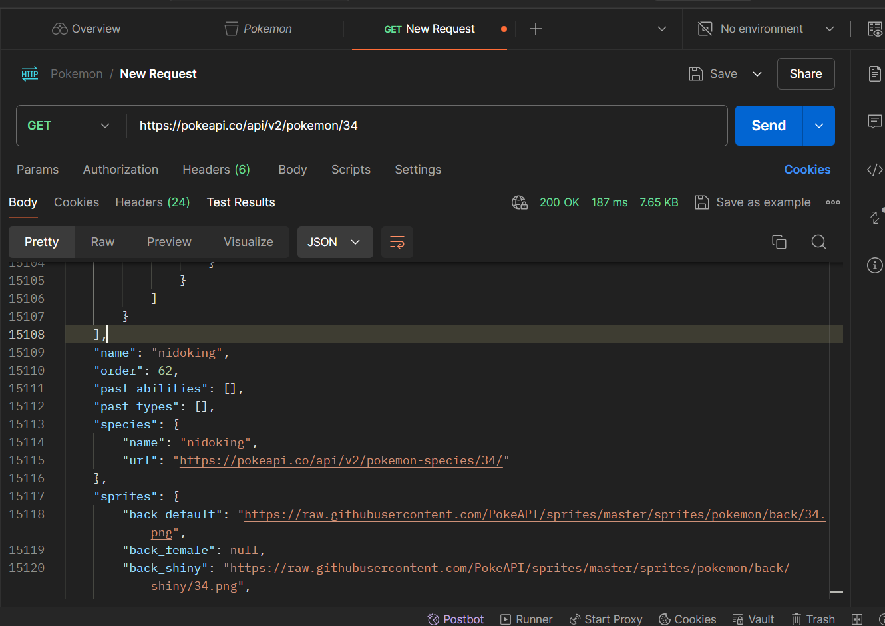
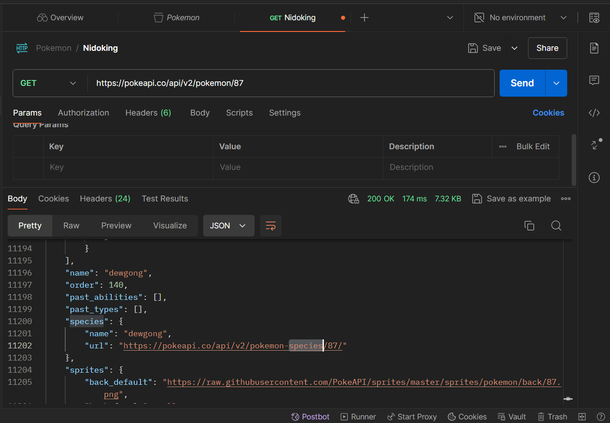
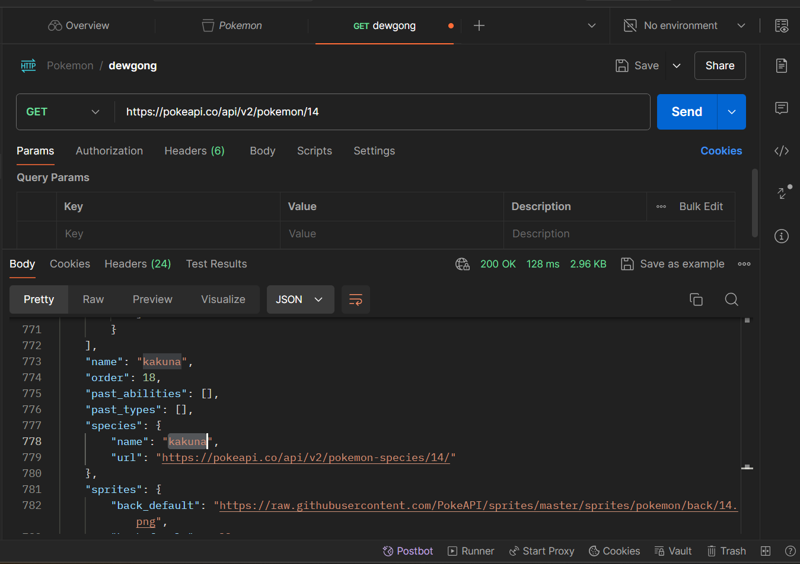

# Introduction to APIs

## GET Requests from Postman

### Request 1

#### Nidoking

* Ability: Poison-point
* Height: 14
* Moves: Mega-punch
* Sprites: <https://raw.githubusercontent.com/PokeAPI/sprites/master/sprites/pokemon/34.png>
* Cries:
  - Latest: <https://raw.githubusercontent.com/PokeAPI/cries/main/cries/pokemon/latest/34.ogg>
  - Legacy: <https://raw.githubusercontent.com/PokeAPI/cries/main/cries/pokemon/legacy/34.ogg>

#### Request URL

<https://pokeapi.co/api/v2/pokemon/34>

### Request 2

#### Dewgong

* Ability: Thick-fat, hydration and ice-body
* Height: 17
* Sprites: 
    - front_shiny: <https://raw.githubusercontent.com/PokeAPI/sprites/master/sprites/pokemon/shiny/87.png>

    - front_Default: <https://raw.githubusercontent.com/PokeAPI/sprites/master/sprites/pokemon/87.png>

* Cries: 
    - Latest: <https://raw.githubusercontent.com/PokeAPI/cries/ main/cries/pokemon/latest/87.ogg>

    - Legacy: <https://raw.githubusercontent.com/PokeAPI/cries/main/cries/pokemon/legacy/87.ogg>

#### Request URL

<https://pokeapi.co/api/v2/pokemon/87>

### Request 3

#### Kakuna

* Height: 6
* Ability: "shed-skin"
* Sprites: <https://raw.githubusercontent.com/PokeAPI/sprites/master/sprites/pokemon/14.png>

* Cries:
    - Latest: <https://raw.githubusercontent.com/PokeAPI/cries/main/cries/pokemon/latest/14.ogg>

    - Legacy: <https://raw.githubusercontent.com/PokeAPI/cries/main/cries/pokemon/legacy/14.ogg>

#### Request URL

<https://pokeapi.co/api/v2/pokemon/14>

